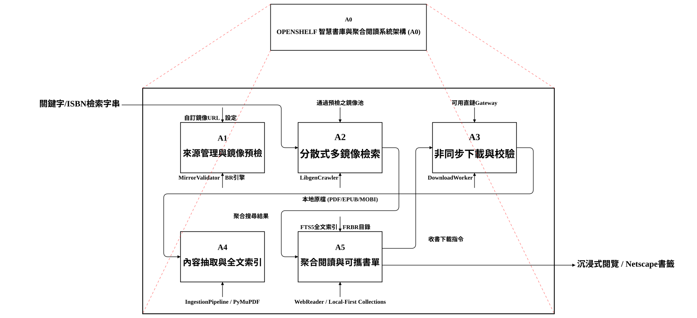
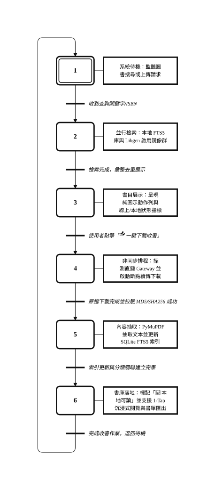

<div align="center">

# 📚 OpenShelf

**現代化個人智慧私有書庫 · 公網電子書即時聚合檢索 · 沉浸式跨裝置閱讀系統**

[](https://www.python.org/)
[](https://fastapi.tiangolo.com/)
[](https://www.sqlite.org/)
[](https://www.docker.com/)
[]()
[](LICENSE)

</div>

---

## 🌟 專案願景 (Vision & Philosophy)

數位圖書愛好者與研究人員常面臨三大核心痛點：
1. **書源分散與鏡像失效**：公網 Libgen 鏡像頻繁被封鎖或改版，下載直鏈經常解析失敗或失效。
2. **行動閱讀體驗低劣**：多數開源書庫介面未針對手機閱讀進行深度 RWD 設計，頂部標題與底欄頻繁遮擋文字視野，翻頁手勢延遲或誤觸。
3. **個人書單難以攜帶**：雲端同步服務繁瑣且綁定帳號，無法輕量無感地在不同裝置與瀏覽器間自由轉移。

**OpenShelf** 是一套以 **IFLA FRBR 書目資料模型** 為骨幹、結合 **公網分散式即時聚合爬蟲**、**自訂來源預檢驗證與自動 BR 派發管線**、**全螢幕手機沉浸式閱讀器** 與 **Local-First 可攜式書單管理** 的全方位個人智慧書庫解決方案。

---

## 📐 系統架構與流程模型 (Architecture Diagrams)

OpenShelf 嚴格遵循國際系統工程與自動化規範，採用 **IDEF0 (IEEE 1320.1)** 描述功能模組資料流，並以 **GRAFCET (IEC 60848)** 刻畫書目收錄與閱讀全生命週期狀態轉移。

### 1. IDEF0 (A0) 系統功能分解模型

<div align="center">
  
</div>

- **A1 來源管理與鏡像預檢 (`MirrorValidator`)**：驗證公網 Libgen 鏡像延遲與解析適配器相容性，未通過者安全隔離並自動產生 Bug Report。
- **A2 分散式多鏡像檢索 (`LibgenCrawler`)**：多鏡像並行查詢、智慧引文拆解與容錯檢索。
- **A3 非同步下載與校驗 (`DownloadWorker`)**：背景任務佇列、HTTP Range 斷點續傳與 MD5/SHA256 完整性校驗。
- **A4 內容抽取與全文索引 (`IngestionPipeline`)**：PyMuPDF 文本抽取、結構化 Markdown 產出與 SQLite FTS5 全文索引。
- **A5 聚合閱讀與可攜書單 (`WebReaderApp`)**：極簡純圖示 UI、沉浸式 1-Tap 閱讀器與 Netscape 標準書籤匯出/匯入。

---

### 2. GRAFCET 圖書收錄與閱讀全生命週期狀態轉移模型

<div align="center">
  
</div>

---

## 🚀 核心功能盤點 (Key Features)

### 🔍 1. 公網分散式即時聚合檢索與直鏈解析
- **多鏡像平行探測**：非同步跨鏡像檢索 `libgen.li`, `libgen.la`, `libgen.rocks`, `libgen.gs`, `libgen.pm`, `libgen.is`, `libgen.rs`, `libgen.st` 等公網目錄。
- **智慧引文拆解器 (Smart Query Disassembler)**：自動識別書名、作者、年份與 ISBN，執行多級階梯式容錯檢索。
- **動態下載直鏈解析**：動態解析鏡像下載頁，支援防盜鏈 Referer 注入與多下載 Gateway 自動輪替。

### 🛡️ 2. 自訂鏡像來源、預檢驗證與自動 BR 派發
- **上線前強制預檢 (Pre-flight Validation Pipeline)**：任何自訂鏡像來源在啟用前必須經由 `MirrorValidator` 進行連線延遲探測與適配器抽樣測試，通過驗證（`verified`）才納入正式爬取池。
- **多爬蟲適配器支援**：內建 `libgen_li`（9 欄式）、`libgen_is`（10 欄式）與 `direct_gateway`（如 `library.lol`）適配器。
- **自動 BR 派發機制 (Auto Bug Report Dispatch)**：若目標鏡像連線正常但 DOM 結構無法解析（因改版或反爬），驗證器自動生成結構化 Bug Report 檔案寫入 `issues/BR-<TIMESTAMP>-<DOMAIN>.md`，並將該來源安全隔離標記為 `incompatible_layout`，方便維護人員快速開發專屬適配器。

### 📖 3. 全螢幕沉浸式閱覽與 1-Tap 即時翻頁手勢引擎
- **純淨無視覺干擾**：閱讀器 Header 與底部進度條平時自動平滑滑出（2 秒無操作自動淡出），提供 100% 純淨全版面文字視野。
- **單擊按一下即刻翻頁 (1-Tap Turning)**：
  - 螢幕左側 35% 或左側翻頁通道 ➔ **單擊立刻翻上一頁**。
  - 螢幕右側 35% 或右側翻頁通道 ➔ **單擊立刻翻下一頁**。
  - 翻頁感測通道永遠保持啟用（`pointer-events: auto !important`），絕不被沉浸模式阻斷。
- **直覺手勢支援**：支援水平快速滑動（Swipe Left/Right）翻頁、雙指多點觸控即時縮放（Multi-Touch Pinch-to-Zoom）與雙擊/點擊中央喚醒控制列。
- **雙格式相容**：同時原生支援 PDF.js 與 EPUB.js，跨裝置即時記憶閱讀進度頁碼。

### 🎨 4. 極簡純圖示 UI 與 RWD 全響應介面
- **純圖示化規範 (Pure Icon UI)**：所有操作按鈕與標籤全面去除文字，保持現代極簡美感，並全面支援原生 Mouseover Tooltip 說明。
- **書卡極簡排版 (Header-Anchored Dropdown)**：書卡頂部首行並排狀態指標（`💾` 本地已存 / 鏡像選框）與「`⋯`」操作按鈕，所有次要操作（`📖` 閱讀、`⭐` 收藏、`📥` 下載、`ℹ️` 詳情）收納於下拉選單。
- **觸發點附著式彈窗系統 (Anchored Popover Dialogs)**：全面取代粗糙的瀏覽器原生 `prompt()` / `alert()`，依據觸發節點動態計算座標展開。
- **低調隱藏式捲軸 (Stealth Scrollbar System)**：自訂深色同底色捲軸，平時極度低調不搶視覺。
- **手機端深度優化**：全版獨立頁（100vw × 100dvh）、兩階段下鑽導航（列表 ➔ 詳情）與頂部 Header 100% 防溢出保護。

### 💼 5. Local-First 個人書單與全球標準書籤可攜
- **預設無感 Local-First**：單機版使用者打開即用，零帳號負擔、零資料庫隔離開銷。
- **全球通用 Netscape 書籤檔匯出 (`.html`)**：一鍵匯出標準書籤檔，可在 Chrome、Safari、Edge、Firefox 點選「匯入書籤」自動還原完整分類資料夾樹與書籍閱讀超連結，或隨時備份至 Google Drive、OneDrive、iCloud。
- **完整備份與還原**：支援導出與匯入 Netscape HTML 書籤檔或 JSON 結構化備份。

### 🏪 6. 線上書攤與多階層樹狀領域分類
- **階層樹狀分類庫**：內建標準中文圖書多階層樹狀分類。
- **有觸及再展開機制 (On-Demand Discovery)**：架位藏書較少時，自動以該領域關鍵字向 Libgen 公網探測熱門書目。
- **混合書架呈現**：同屏展現本地典藏（`💾` 直讀與原檔下載）與雲端精選（`🌐` 一鍵鏡像收書）。

### ⚡ 7. Docker 免 Rebuild 即時 Bind-Mount 熱重載開發環境
- **原始碼外掛架構**：`docker-compose.yml` 將本機 `./app` 直接掛載至容器 `/app/app`。
- **Uvicorn 自動熱重載**：修改任何後端 Python 邏輯、REST 路由或前端 HTML/CSS/JS 靜態資源，存檔即刻生效，徹底告別耗時的容器重建流程。

---

## 🛠️ 技術棧 (Technology Stack)

| 領域 | 技術選型 | 說明 |
| :--- | :--- | :--- |
| **後端核心** | Python 3.11 / 3.12, FastAPI, Uvicorn | 高效能非同步 Web 框架與 RESTful API |
| **資料持久層** | SQLite 3 + FTS5 + JSON1 | 單檔案零設定、支援中文全文檢索與階層查詢 |
| **爬蟲與解析** | HTTPX, BeautifulSoup4, Selectolax | 非同步分散式爬蟲、動態 DOM 解析與適配器 |
| **文件處理** | PyMuPDF (Fitz), EbookLib | PDF / EPUB / MOBI 文本抽取與中繼資料解析 |
| **前端架構** | 原生 Vanilla JS (ES6+), Vanilla CSS | 極致輕量、零前端構建依賴（Zero-Build） |
| **閱讀引擎** | PDF.js, EPUB.js | 跨平台標準瀏覽器閱讀器與即時進度同步 |
| **容器化部署** | Docker, Docker Compose | 免 Rebuild 即時熱掛載開發與生產環境 |
| **品質驗證** | Pytest, Playwright | 單元測試、API 整合測試與 E2E 瀏覽器自動化測試 |

---

## 📦 快速開始 (Quick Start)

### 方法一：使用 Docker Compose 一鍵啟動 (推薦)

```bash
# 1. 複製專案庫
git clone git@github.com:raw1mage/openshelf.git
cd openshelf

# 2. 啟動 Docker 容器
docker compose up -d

# 3. 開啟瀏覽器訪問
# 首頁：http://localhost:8088/libgen/
# API 文件：http://localhost:8088/libgen/docs
```

> 💡 **熱重載開發**：本機修改 `app/` 目錄下的任何檔案，容器內將即時自動重新載入，無須執行 `docker compose build`。

---

### 方法二：本機直接運行

```bash
# 1. 建立並啟用 Python 虛擬環境
python3 -m venv .venv
source .venv/bin/activate

# 2. 安裝相依套件
pip install -r requirements.txt

# 3. 啟動伺服器
uvicorn app.main:app --host 0.0.0.0 --port 8000 --reload
```

---

## 🧪 測試與品質驗證 (Testing)

OpenShelf 具備完整的自動化測試套件，涵蓋儲存管理、資料管線、API 路由、分類系統、個人書單、鏡像驗證器與 E2E 全流程：

```bash
# 執行全套測試
PYTHONPATH=. pytest -v tests/
```

**測試結果**：
```
tests/test_api.py::test_api_health PASSED                                           [  6%]
tests/test_api.py::test_api_upload_and_search PASSED                                [ 12%]
tests/test_categories.py::test_category_tree_and_works PASSED                       [ 18%]
tests/test_categories.py::test_category_cloud_queries PASSED                        [ 25%]
tests/test_collections.py::test_collection_lifecycle PASSED                         [ 31%]
tests/test_crawler.py::test_parse_size_to_bytes PASSED                              [ 37%]
tests/test_crawler.py::test_parse_libgen_html PASSED                                [ 43%]
tests/test_crawler.py::test_download_worker_job_lifecycle PASSED                    [ 50%]
tests/test_e2e.py::test_full_e2e_flow PASSED                                        [ 56%]
tests/test_pipeline.py::test_ingestion_pipeline_pdf PASSED                          [ 62%]
tests/test_settings_and_validator.py::test_dao_libgen_mirrors_lifecycle PASSED      [ 68%]
tests/test_settings_and_validator.py::test_validator_libgen_li_success PASSED       [ 75%]
tests/test_settings_and_validator.py::test_validator_libgen_is_success PASSED       [ 81%]
tests/test_settings_and_validator.py::test_validator_incompatible_layout_auto_dispatch_br PASSED [ 87%]
tests/test_settings_and_validator.py::test_settings_api_endpoints PASSED            [ 93%]
tests/test_storage.py::test_storage_manager_basic PASSED                            [100%]

============================== 16 passed in 1.31s ==============================
```

---

## 📂 專案目錄結構 (Directory Structure)

```
openshelf/
├── app/
│   ├── api/                  # RESTful API 路由
│   │   ├── routes.py         # 圖書檢索、閱讀、上傳
│   │   ├── crawler_routes.py # 即時爬蟲與下載任務
│   │   ├── category_routes.py# 分類樹與書攤探索
│   │   ├── collection_routes.py # 個人書單管理
│   │   └── settings_routes.py# 系統設定與鏡像驗證
│   ├── crawler/              # 爬蟲與解析引擎
│   │   ├── libgen_live.py    # 多鏡像即時檢索
│   │   ├── mirror_resolver.py# 直鏈解析器
│   │   ├── download_worker.py# 斷點續傳背景下載
│   │   └── validator.py      # 鏡像預檢驗證與自動 BR
│   ├── db/                   # 資料持久層
│   │   ├── schema.sql        # FRBR 資料表綱要
│   │   ├── engine.py         # SQLite 連線管理
│   │   ├── dao.py            # 資料存取物件 (DAO)
│   │   ├── search.py         # FTS5 全文檢索
│   │   └── categories.py     # 分類樹定義
│   ├── models/               # Pydantic 規格資料模型
│   │   └── catalog.py        # FRBR 與 API 資料結構
│   ├── pipeline/             # 文本抽取管線
│   │   └── ingest.py         # 檔案落地與 FTS5 索引
│   ├── storage/              # 儲存管理
│   │   └── manager.py        # 檔案目錄與雜湊校驗
│   └── static/               # 前端靜態資源 (Zero-Build)
│       ├── index.html        # 主介面
│       ├── reader.html       # 沉浸式閱讀器介面
│       ├── css/style.css     # RWD 現代樣式系統
│       └── js/
│           ├── app.js        # 主應用程式邏輯
│           ├── reader.js     # 閱讀器與 1-Tap 翻頁手勢
│           └── modal-dialog.js # 觸發點附著對話框系統
├── docs/                     # 架構文件與圖表
│   ├── ARCHITECTURE.md       # 詳細架構技術白皮書
│   └── diagrams/             # IDEF0 與 GRAFCET SVG 圖表
│       ├── idef0_architecture.svg
│       └── grafcet_pipeline.svg
├── tests/                    # 自動化測試套件
├── docker-compose.yml        # Docker 即時掛載編排檔
├── Dockerfile                # 固態相依底座映像檔
├── requirements.txt          # Python 相依清單
└── README.md                 # 專案說明文件 (本文件)
```

---

## 📜 授權條款 (License)

本專案基於 **MIT 授權條款** 釋出，歡迎社群自由使用、修改、擴充與貢獻。詳情請參閱 [LICENSE](LICENSE) 檔案。

---

<div align="center">
  <b>OpenShelf — 開啟您的私有智慧數位書庫之旅</b>
</div>
