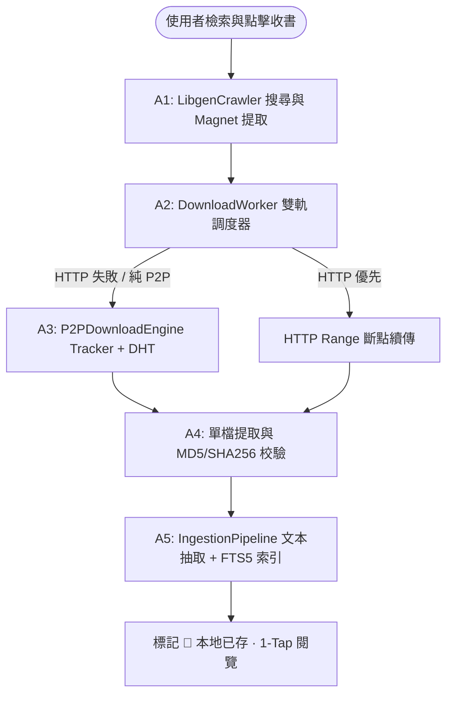

# Design: aggregator_torrent-p2p-integration

## Context

目前 OpenShelf 的公網圖書檢索主要依賴第三方 HTTP 鏡像（`libgen.li`, `libgen.rocks`, `library.lol`）。當這些鏡像面臨網域封鎖、伺服器過載或冷門大檔遺失時，下載管線容易中斷。本計畫旨在透過內嵌輕量 P2P 下載引擎與雙軌調度器，將 BitTorrent / Magnet 網路無縫整合至 OpenShelf 中。

## Goals / Non-Goals

### Goals
- 支援在檢索時自動解析並提取種子直鏈與 Magnet URI。
- 建立輕量非同步 `P2PDownloadEngine`，支援 Magnet 解析、Tracker 宣告、DHT 與單檔選擇性 Piece 抓取。
- 實作「HTTP 優先 ➔ P2P 自動備援（Failover）」的雙軌調度機制，使用者無須手動切換協定。
- 完檔後無縫送入 `IngestionPipeline` 抽取 Markdown 文本並更新 SQLite FTS5 索引。
- 齒輪設定面板提供 Tracker 節點池管理與頻寬限制。

### Non-Goals
- 不外掛獨立重型 BT 客戶端容器（如 qBittorrent-nox WebUI），維持單一容器架構。
- 不實作跨網路私有 Token 付費種子站爬蟲。

## Architecture & IDEF0 Alignment

本架構嚴格依據 IDEF0 (A0) 功能模型骨架實作：
- **A1 來源解析 (Torrent / Magnet Search Extraction)**：`LibgenCrawler` 檢索時提取書目關聯之 `torrent_url` 與 `magnet_uri`。
- **A2 雙軌調度 (Dual-Track Scheduler & Failover)**：`DownloadWorker` 優先嘗試 HTTP 直鏈，若失敗則自動將任務轉移至 P2P 下載佇列。
- **A3 非同步 P2P 下載 (Async P2P Engine)**：`P2PDownloadEngine` 透過 Tracker 宣告與 DHT 網路向 Peers 抓取目標 Pieces。
- **A4 單檔提取與校驗 (Selective Extraction & Checksum)**：從 Torrent 封包中提取目標單檔，並執行 MD5 / SHA256 完整性校驗。
- **A5 內容抽取與索引落地 (Ingestion & Storage)**：`IngestionPipeline` 抽取 Markdown 文本、更新 FTS5 索引並標記為 `💾 本地已存`。

## Decisions

### DD-1: 雙軌下載智慧調度策略 (HTTP-First with Automatic P2P Failover)
- **決策**：一律以 HTTP 鏡像為第一優先級（啟動快、延遲低）。當 HTTP 鏡像均失效、逾時或返回 404/5xx 時，自動無感切換至 P2P 下載，無需使用者介入。

### DD-2: 內嵌式輕量 P2P 下載引擎架構 (`app/crawler/torrent_engine.py`)
- **決策**：在後端封裝非同步 `P2PDownloadEngine`，支援 Magnet URI 解析、Tracker 宣告、DHT、單檔選擇性下載與完檔後背景限時做種（10 分鐘）。

### DD-3: 資料模型擴充
- **決策**：`SearchResultItem` 與 `Manifestation` 擴充 `torrent_url` 與 `magnet_uri`。

### DD-4: 零感知前端使用者體驗
- **決策**：前端搜尋結果與下載按鈕保持純圖示統一風格；下載佇列（Queue Modal）即時呈現協定狀態與 Peer 數量。

### DD-5: 齒輪系統設定擴充
- **決策**：設定頁面擴充公共 Tracker 池清單與最大下載頻寬/連線數限制。

## Risks / Trade-offs

- **首字節延遲 (Time to First Byte)**：P2P 需先向 Tracker 宣告並握手 Peers，初始耗時較 HTTP 直鏈稍長。
  - *緩解措施*：預設 HTTP-First，僅在 HTTP 失效或純 P2P 來源時使用 Torrent，並內建高響應之公共 Tracker 池。
- **內網 NAT 穿透**：純內網無公網 IP 環境可能 Peer 較少。
  - *緩解措施*：預設注入 8~10 組全球活躍 Tracker 節點與 DHT 網路，最大化 Peer 發現率。

## Critical Files

- `app/crawler/torrent_engine.py` — 內嵌 P2P 下載引擎
- `app/crawler/download_worker.py` — 雙軌調度器與自動 Failover
- `app/crawler/libgen_live.py` — 種子與 Magnet 搜尋解析
- `app/models/catalog.py` — 資料模型擴充
- `app/static/js/app.js` — 前端佇列狀態與齒輪設定整合
